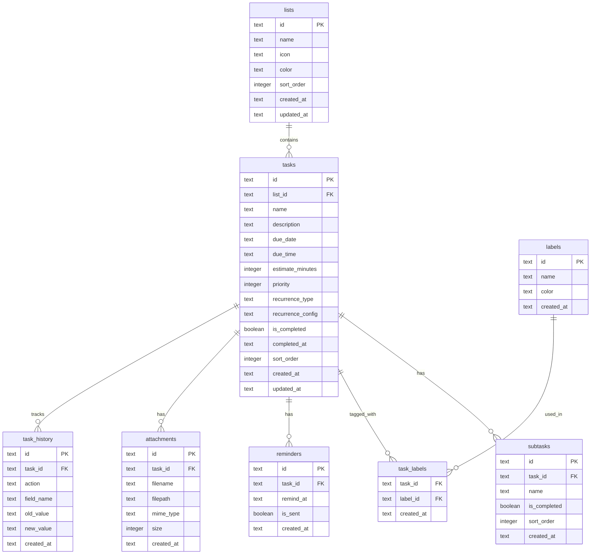
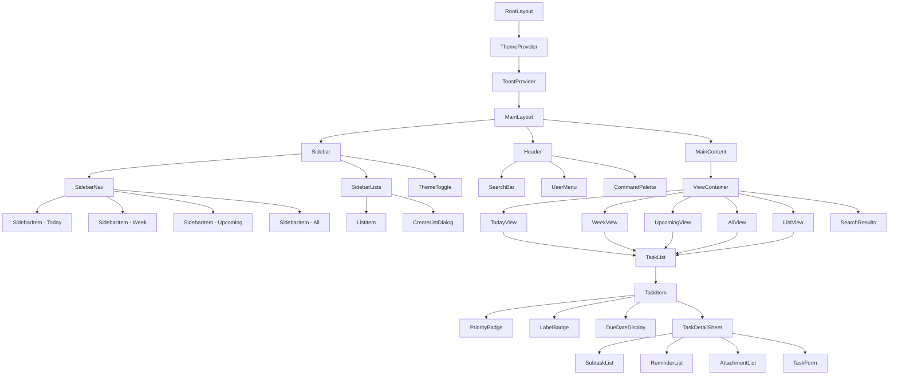
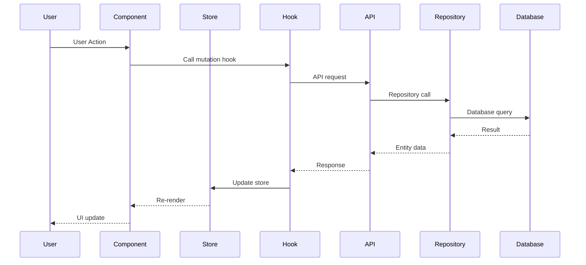

# Daily Task Planner - Architecture Document

## Table of Contents

1. [Project Overview](#project-overview)
2. [Project Structure](#project-structure)
3. [Database Schema](#database-schema)
4. [Type Definitions](#type-definitions)
5. [API Routes Design](#api-routes-design)
6. [Component Architecture](#component-architecture)
7. [Styling Approach](#styling-approach)
8. [Testing Strategy](#testing-strategy)

---

## Project Overview

A modern, professional daily task planner built with Next.js 16, featuring comprehensive task management capabilities including lists, tasks with rich properties, multiple views, and fuzzy search functionality.

### Technical Stack

| Technology | Purpose |
|------------|---------|
| Bun | Runtime and package manager |
| Next.js 16 | React framework with App Router |
| TypeScript | Type-safe JavaScript with strict mode |
| Tailwind CSS | Utility-first CSS framework |
| shadcn/ui | Component library |
| Framer Motion | Animation library |
| SQLite | Local database via better-sqlite3 |
| Bun Test | Unit testing framework |

---

## Project Structure

### Complete Folder Structure

```
todo-glm-5/
├── .bun/                          # Bun installation files
├── .github/                       # GitHub workflows and templates
│   └── workflows/
│       └── ci.yml                 # CI/CD pipeline
├── public/                        # Static assets
│   ├── fonts/                     # Custom fonts
│   ├── icons/                     # App icons and favicons
│   └── images/                    # Static images
├── src/
│   ├── app/                       # Next.js App Router
│   │   ├── (auth)/               # Auth route group
│   │   │   └── login/
│   │   │       └── page.tsx
│   │   ├── (main)/               # Main app route group
│   │   │   ├── layout.tsx        # Main layout with sidebar
│   │   │   ├── page.tsx          # Home/Today view
│   │   │   ├── inbox/
│   │   │   │   └── page.tsx
│   │   │   ├── today/
│   │   │   │   └── page.tsx
│   │   │   ├── week/
│   │   │   │   └── page.tsx      # Next 7 Days view
│   │   │   ├── upcoming/
│   │   │   │   └── page.tsx
│   │   │   ├── all/
│   │   │   │   └── page.tsx
│   │   │   ├── list/
│   │   │   │   └── [listId]/
│   │   │   │       └── page.tsx
│   │   │   ├── search/
│   │   │   │   └── page.tsx
│   │   │   └── task/
│   │   │       └── [taskId]/
│   │   │           └── page.tsx  # Task detail view
│   │   ├── api/                  # API routes
│   │   │   ├── lists/
│   │   │   │   ├── route.ts      # GET all, POST new
│   │   │   │   └── [listId]/
│   │   │   │       └── route.ts  # GET, PUT, DELETE single
│   │   │   ├── tasks/
│   │   │   │   ├── route.ts      # GET all, POST new
│   │   │   │   ├── [taskId]/
│   │   │   │   │   └── route.ts  # GET, PUT, DELETE single
│   │   │   │   ├── batch/
│   │   │   │   │   └── route.ts  # Batch operations
│   │   │   │   └── search/
│   │   │   │       └── route.ts  # Search endpoint
│   │   │   ├── subtasks/
│   │   │   │   └── route.ts
│   │   │   ├── labels/
│   │   │   │   └── route.ts
│   │   │   ├── reminders/
│   │   │   │   └── route.ts
│   │   │   └── attachments/
│   │   │       └── route.ts
│   │   ├── layout.tsx            # Root layout
│   │   ├── globals.css           # Global styles
│   │   └── not-found.tsx         # 404 page
│   ├── components/
│   │   ├── ui/                   # shadcn/ui components
│   │   │   ├── button.tsx
│   │   │   ├── card.tsx
│   │   │   ├── checkbox.tsx
│   │   │   ├── dialog.tsx
│   │   │   ├── dropdown-menu.tsx
│   │   │   ├── input.tsx
│   │   │   ├── label.tsx
│   │   │   ├── popover.tsx
│   │   │   ├── scroll-area.tsx
│   │   │   ├── select.tsx
│   │   │   ├── separator.tsx
│   │   │   ├── sheet.tsx
│   │   │   ├── skeleton.tsx
│   │   │   ├── switch.tsx
│   │   │   ├── tabs.tsx
│   │   │   ├── textarea.tsx
│   │   │   ├── toast.tsx
│   │   │   ├── toaster.tsx
│   │   │   └── tooltip.tsx
│   │   ├── layout/               # Layout components
│   │   │   ├── sidebar/
│   │   │   │   ├── sidebar.tsx
│   │   │   │   ├── sidebar-nav.tsx
│   │   │   │   ├── sidebar-lists.tsx
│   │   │   │   └── sidebar-item.tsx
│   │   │   ├── header/
│   │   │   │   ├── header.tsx
│   │   │   │   ├── search-bar.tsx
│   │   │   │   └── user-menu.tsx
│   │   │   └── command-palette.tsx
│   │   ├── tasks/                # Task-related components
│   │   │   ├── task-list.tsx
│   │   │   ├── task-item.tsx
│   │   │   ├── task-detail.tsx
│   │   │   ├── task-form.tsx
│   │   │   ├── task-create-dialog.tsx
│   │   │   ├── task-edit-sheet.tsx
│   │   │   ├── subtask-list.tsx
│   │   │   ├── subtask-item.tsx
│   │   │   ├── priority-badge.tsx
│   │   │   ├── due-date-picker.tsx
│   │   │   ├── reminder-picker.tsx
│   │   │   ├── estimate-input.tsx
│   │   │   ├── recurrence-editor.tsx
│   │   │   └── attachment-upload.tsx
│   │   ├── lists/                # List-related components
│   │   │   ├── list-create-dialog.tsx
│   │   │   ├── list-edit-dialog.tsx
│   │   │   ├── list-color-picker.tsx
│   │   │   ├── list-icon-picker.tsx
│   │   │   └── list-item.tsx
│   │   ├── labels/               # Label components
│   │   │   ├── label-badge.tsx
│   │   │   ├── label-picker.tsx
│   │   │   ├── label-create-dialog.tsx
│   │   │   └── label-edit-dialog.tsx
│   │   ├── views/                # View components
│   │   │   ├── today-view.tsx
│   │   │   ├── week-view.tsx
│   │   │   ├── upcoming-view.tsx
│   │   │   ├── all-view.tsx
│   │   │   └── list-view.tsx
│   │   ├── search/               # Search components
│   │   │   ├── search-results.tsx
│   │   │   └── search-filter.tsx
│   │   └── common/               # Shared components
│   │       ├── loading-spinner.tsx
│   │       ├── empty-state.tsx
│   │       ├── confirm-dialog.tsx
│   │       ├── date-display.tsx
│   │       ├── relative-date.tsx
│   │       ├── emoji-picker.tsx
│   │       ├── color-picker.tsx
│   │       └── theme-toggle.tsx
│   ├── lib/
│   │   ├── db/
│   │   │   ├── index.ts          # Database connection
│   │   │   ├── schema.sql        # SQL schema definitions
│   │   │   ├── migrations/       # Database migrations
│   │   │   │   ├── 001_initial.ts
│   │   │   │   └── index.ts
│   │   │   └── seed.ts           # Seed data
│   │   ├── repositories/         # Data access layer
│   │   │   ├── base.repository.ts
│   │   │   ├── list.repository.ts
│   │   │   ├── task.repository.ts
│   │   │   ├── subtask.repository.ts
│   │   │   ├── label.repository.ts
│   │   │   ├── reminder.repository.ts
│   │   │   └── attachment.repository.ts
│   │   ├── services/             # Business logic layer
│   │   │   ├── task.service.ts
│   │   │   ├── list.service.ts
│   │   │   ├── search.service.ts
│   │   │   └── reminder.service.ts
│   │   ├── utils/
│   │   │   ├── date.ts           # Date utilities
│   │   │   ├── fuzzy-search.ts   # Fuzzy search implementation
│   │   │   ├── recurrence.ts     # Recurrence calculations
│   │   │   └── validators.ts     # Input validation
│   │   └── constants.ts          # App constants
│   ├── hooks/                    # Custom React hooks
│   │   ├── use-tasks.ts
│   │   ├── use-lists.ts
│   │   ├── use-labels.ts
│   │   ├── use-search.ts
│   │   ├── use-task-mutations.ts
│   │   ├── use-keyboard-shortcuts.ts
│   │   └── use-local-storage.ts
│   ├── stores/                   # State management
│   │   ├── task-store.ts
│   │   ├── ui-store.ts
│   │   └── index.ts
│   ├── types/                    # TypeScript definitions
│   │   ├── index.ts              # Barrel export
│   │   ├── entities.ts           # Entity types
│   │   ├── enums.ts              # Enum types
│   │   ├── api.ts                # API request/response types
│   │   └── utils.ts              # Utility types
│   └── providers/                # React context providers
│       ├── theme-provider.tsx
│       ├── toast-provider.tsx
│       └── query-provider.tsx
├── tests/                        # Test files
│   ├── unit/
│   │   ├── lib/
│   │   │   ├── utils/
│   │   │   │   ├── date.test.ts
│   │   │   │   ├── fuzzy-search.test.ts
│   │   │   │   └── recurrence.test.ts
│   │   │   └── services/
│   │   │       ├── task.service.test.ts
│   │   │       └── search.service.test.ts
│   │   └── components/
│   │       ├── task-item.test.ts
│   │       └── task-list.test.ts
│   ├── integration/
│   │   └── api/
│   │       ├── tasks.test.ts
│   │       └── lists.test.ts
│   └── fixtures/
│       └── test-data.ts
├── bunfig.toml                   # Bun configuration
├── tailwind.config.ts            # Tailwind configuration
├── tsconfig.json                 # TypeScript configuration
├── next.config.ts                # Next.js configuration
├── package.json                  # Dependencies and scripts
└── ARCHITECTURE.md               # This document
```

### File Naming Conventions

| Type | Convention | Example |
|------|------------|---------|
| Components | PascalCase | `TaskList.tsx`, `TaskItem.tsx` |
| Hooks | camelCase with `use-` prefix | `use-tasks.ts` |
| Utilities | camelCase | `date.ts`, `validators.ts` |
| Types | camelCase | `entities.ts`, `enums.ts` |
| API Routes | lowercase | `route.ts` |
| Tests | Same as source with `.test.ts` | `task.service.test.ts` |
| Constants | SCREAMING_SNAKE_CASE | inside `constants.ts` |

### Module Organization

Each feature module follows a consistent pattern:

```
feature/
├── components/       # UI components for the feature
├── hooks/           # Feature-specific hooks
├── types/           # Feature-specific types
├── utils/           # Feature-specific utilities
└── index.ts         # Barrel export
```

---

## Database Schema

### Entity-Relationship Diagram



### Table Definitions

#### lists

```sql
CREATE TABLE lists (
    id TEXT PRIMARY KEY,
    name TEXT NOT NULL,
    icon TEXT DEFAULT '📋',
    color TEXT DEFAULT '#6366f1',
    sort_order INTEGER DEFAULT 0,
    created_at TEXT DEFAULT CURRENT_TIMESTAMP,
    updated_at TEXT DEFAULT CURRENT_TIMESTAMP
);

CREATE INDEX idx_lists_sort_order ON lists(sort_order);
```

**Notes:**
- `id`: UUID v4 string
- `icon`: Emoji character for visual identification
- `color`: Hex color code for UI theming
- Default "Inbox" list has id `inbox` and cannot be deleted

#### tasks

```sql
CREATE TABLE tasks (
    id TEXT PRIMARY KEY,
    list_id TEXT NOT NULL REFERENCES lists(id) ON DELETE CASCADE,
    name TEXT NOT NULL,
    description TEXT,
    due_date TEXT,
    due_time TEXT,
    estimate_minutes INTEGER,
    priority INTEGER DEFAULT 0,
    recurrence_type TEXT,
    recurrence_config TEXT,
    is_completed INTEGER DEFAULT 0,
    completed_at TEXT,
    sort_order INTEGER DEFAULT 0,
    created_at TEXT DEFAULT CURRENT_TIMESTAMP,
    updated_at TEXT DEFAULT CURRENT_TIMESTAMP
);

CREATE INDEX idx_tasks_list_id ON tasks(list_id);
CREATE INDEX idx_tasks_due_date ON tasks(due_date);
CREATE INDEX idx_tasks_is_completed ON tasks(is_completed);
CREATE INDEX idx_tasks_priority ON tasks(priority);
CREATE INDEX idx_tasks_sort_order ON tasks(sort_order);
```

**Notes:**
- `priority`: 0 = None, 1 = Low, 2 = Medium, 3 = High, 4 = Urgent
- `recurrence_type`: NULL, 'daily', 'weekly', 'monthly', 'yearly', 'custom'
- `recurrence_config`: JSON string for custom recurrence rules
- `due_date`: ISO 8601 date string (YYYY-MM-DD)
- `due_time`: ISO 8601 time string (HH:MM)

#### subtasks

```sql
CREATE TABLE subtasks (
    id TEXT PRIMARY KEY,
    task_id TEXT NOT NULL REFERENCES tasks(id) ON DELETE CASCADE,
    name TEXT NOT NULL,
    is_completed INTEGER DEFAULT 0,
    sort_order INTEGER DEFAULT 0,
    created_at TEXT DEFAULT CURRENT_TIMESTAMP
);

CREATE INDEX idx_subtasks_task_id ON subtasks(task_id);
CREATE INDEX idx_subtasks_sort_order ON subtasks(task_id, sort_order);
```

#### labels

```sql
CREATE TABLE labels (
    id TEXT PRIMARY KEY,
    name TEXT NOT NULL UNIQUE,
    color TEXT DEFAULT '#64748b',
    created_at TEXT DEFAULT CURRENT_TIMESTAMP
);

CREATE INDEX idx_labels_name ON labels(name);
```

#### task_labels

```sql
CREATE TABLE task_labels (
    task_id TEXT NOT NULL REFERENCES tasks(id) ON DELETE CASCADE,
    label_id TEXT NOT NULL REFERENCES labels(id) ON DELETE CASCADE,
    created_at TEXT DEFAULT CURRENT_TIMESTAMP,
    PRIMARY KEY (task_id, label_id)
);
```

#### reminders

```sql
CREATE TABLE reminders (
    id TEXT PRIMARY KEY,
    task_id TEXT NOT NULL REFERENCES tasks(id) ON DELETE CASCADE,
    remind_at TEXT NOT NULL,
    is_sent INTEGER DEFAULT 0,
    created_at TEXT DEFAULT CURRENT_TIMESTAMP
);

CREATE INDEX idx_reminders_task_id ON reminders(task_id);
CREATE INDEX idx_reminders_remind_at ON reminders(remind_at);
CREATE INDEX idx_reminders_is_sent ON reminders(is_sent);
```

**Notes:**
- `remind_at`: ISO 8601 datetime string
- `is_sent`: 0 = pending, 1 = sent

#### attachments

```sql
CREATE TABLE attachments (
    id TEXT PRIMARY KEY,
    task_id TEXT NOT NULL REFERENCES tasks(id) ON DELETE CASCADE,
    filename TEXT NOT NULL,
    filepath TEXT NOT NULL,
    mime_type TEXT,
    size INTEGER,
    created_at TEXT DEFAULT CURRENT_TIMESTAMP
);

CREATE INDEX idx_attachments_task_id ON attachments(task_id);
```

**Notes:**
- Files stored in `./data/attachments/` directory
- `filepath`: Relative path from attachments directory

#### task_history

```sql
CREATE TABLE task_history (
    id TEXT PRIMARY KEY,
    task_id TEXT NOT NULL REFERENCES tasks(id) ON DELETE CASCADE,
    action TEXT NOT NULL,
    field_name TEXT,
    old_value TEXT,
    new_value TEXT,
    created_at TEXT DEFAULT CURRENT_TIMESTAMP
);

CREATE INDEX idx_task_history_task_id ON task_history(task_id);
CREATE INDEX idx_task_history_created_at ON task_history(created_at);
```

**Notes:**
- `action`: 'created', 'updated', 'completed', 'uncompleted', 'deleted'
- `field_name`: Name of changed field for 'updated' action
- `old_value`/`new_value`: JSON-serialized values

### Migration Strategy

Migrations are managed programmatically with version tracking:

```typescript
// Migration file structure
interface Migration {
  version: number;
  name: string;
  up: (db: Database) => void;
  down: (db: Database) => void;
}

// Migration tracking table
CREATE TABLE migrations (
    version INTEGER PRIMARY KEY,
    name TEXT NOT NULL,
    applied_at TEXT DEFAULT CURRENT_TIMESTAMP
);
```

**Migration Process:**
1. On app startup, check current migration version
2. Apply pending migrations in order
3. Record each successful migration
4. Support rollback for development

---

## Type Definitions

### Enum Types

```typescript
// src/types/enums.ts

export enum Priority {
  None = 0,
  Low = 1,
  Medium = 2,
  High = 3,
  Urgent = 4,
}

export enum RecurrenceType {
  None = 'none',
  Daily = 'daily',
  Weekly = 'weekly',
  Monthly = 'monthly',
  Yearly = 'yearly',
  Custom = 'custom',
}

export enum TaskAction {
  Created = 'created',
  Updated = 'updated',
  Completed = 'completed',
  Uncompleted = 'uncompleted',
  Deleted = 'deleted',
}

export enum ViewType {
  Today = 'today',
  Week = 'week',
  Upcoming = 'upcoming',
  All = 'all',
  List = 'list',
  Inbox = 'inbox',
}

export enum SortBy {
  DueDate = 'due_date',
  Priority = 'priority',
  Name = 'name',
  CreatedAt = 'created_at',
  ListOrder = 'sort_order',
}

export enum SortOrder {
  Asc = 'asc',
  Desc = 'desc',
}
```

### Entity Types

```typescript
// src/types/entities.ts

import { Priority, RecurrenceType, TaskAction } from './enums';

export interface List {
  id: string;
  name: string;
  icon: string;
  color: string;
  sortOrder: number;
  createdAt: string;
  updatedAt: string;
}

export interface Task {
  id: string;
  listId: string;
  name: string;
  description: string | null;
  dueDate: string | null;
  dueTime: string | null;
  estimateMinutes: number | null;
  priority: Priority;
  recurrenceType: RecurrenceType | null;
  recurrenceConfig: RecurrenceConfig | null;
  isCompleted: boolean;
  completedAt: string | null;
  sortOrder: number;
  createdAt: string;
  updatedAt: string;
  // Relations (populated on fetch)
  subtasks?: Subtask[];
  labels?: Label[];
  reminders?: Reminder[];
  attachments?: Attachment[];
}

export interface Subtask {
  id: string;
  taskId: string;
  name: string;
  isCompleted: boolean;
  sortOrder: number;
  createdAt: string;
}

export interface Label {
  id: string;
  name: string;
  color: string;
  createdAt: string;
}

export interface TaskLabel {
  taskId: string;
  labelId: string;
  createdAt: string;
}

export interface Reminder {
  id: string;
  taskId: string;
  remindAt: string;
  isSent: boolean;
  createdAt: string;
}

export interface Attachment {
  id: string;
  taskId: string;
  filename: string;
  filepath: string;
  mimeType: string | null;
  size: number | null;
  createdAt: string;
}

export interface TaskHistory {
  id: string;
  taskId: string;
  action: TaskAction;
  fieldName: string | null;
  oldValue: string | null;
  newValue: string | null;
  createdAt: string;
}

export interface RecurrenceConfig {
  interval: number;
  unit: 'day' | 'week' | 'month' | 'year';
  daysOfWeek?: number[];
  dayOfMonth?: number;
  endDate?: string;
  maxOccurrences?: number;
}
```

### API Request/Response Types

```typescript
// src/types/api.ts

import { Priority, RecurrenceType, SortBy, SortOrder } from './enums';
import { List, Task, Subtask, Label, Reminder, Attachment } from './entities';

// Pagination
export interface PaginationParams {
  page?: number;
  limit?: number;
}

export interface PaginatedResponse<T> {
  data: T[];
  pagination: {
    page: number;
    limit: number;
    total: number;
    totalPages: number;
  };
}

// List API
export interface CreateListRequest {
  name: string;
  icon?: string;
  color?: string;
}

export interface UpdateListRequest {
  name?: string;
  icon?: string;
  color?: string;
  sortOrder?: number;
}

export interface ListResponse extends List {
  taskCount: number;
  completedTaskCount: number;
}

// Task API
export interface CreateTaskRequest {
  listId: string;
  name: string;
  description?: string;
  dueDate?: string;
  dueTime?: string;
  estimateMinutes?: number;
  priority?: Priority;
  recurrenceType?: RecurrenceType;
  recurrenceConfig?: RecurrenceConfig;
  labelIds?: string[];
  subtasks?: CreateSubtaskRequest[];
}

export interface UpdateTaskRequest {
  listId?: string;
  name?: string;
  description?: string | null;
  dueDate?: string | null;
  dueTime?: string | null;
  estimateMinutes?: number | null;
  priority?: Priority;
  recurrenceType?: RecurrenceType | null;
  recurrenceConfig?: RecurrenceConfig | null;
  isCompleted?: boolean;
  sortOrder?: number;
}

export interface TaskQueryParams extends PaginationParams {
  listId?: string;
  isCompleted?: boolean;
  priority?: Priority;
  dueDateFrom?: string;
  dueDateTo?: string;
  labelIds?: string[];
  sortBy?: SortBy;
  sortOrder?: SortOrder;
  search?: string;
}

export interface TaskResponse extends Task {
  list: List;
}

// Subtask API
export interface CreateSubtaskRequest {
  taskId: string;
  name: string;
}

export interface UpdateSubtaskRequest {
  name?: string;
  isCompleted?: boolean;
  sortOrder?: number;
}

// Label API
export interface CreateLabelRequest {
  name: string;
  color?: string;
}

export interface UpdateLabelRequest {
  name?: string;
  color?: string;
}

// Reminder API
export interface CreateReminderRequest {
  taskId: string;
  remindAt: string;
}

// Attachment API
export interface CreateAttachmentRequest {
  taskId: string;
  file: File;
}

// Search API
export interface SearchParams {
  query: string;
  scope?: 'all' | 'tasks' | 'lists' | 'labels';
  fuzzyThreshold?: number;
}

export interface SearchResult {
  tasks: Task[];
  lists: List[];
  labels: Label[];
  highlights: Map<string, string[]>;
}

// Batch Operations
export interface BatchUpdateRequest {
  taskIds: string[];
  updates: UpdateTaskRequest;
}

export interface BatchDeleteRequest {
  taskIds: string[];
}

export interface BatchMoveRequest {
  taskIds: string[];
  listId: string;
}

// API Response wrapper
export interface ApiResponse<T> {
  success: boolean;
  data?: T;
  error?: {
    code: string;
    message: string;
    details?: Record<string, unknown>;
  };
}
```

### Utility Types

```typescript
// src/types/utils.ts

export type Optional<T, K extends keyof T> = Omit<T, K> & Partial<Pick<T, K>>;

export type WithRequired<T, K extends keyof T> = T & { [P in K]-?: T[P] };

export type DeepPartial<T> = {
  [P in keyof T]?: T[P] extends object ? DeepPartial<T[P]> : T[P];
};

export type Prettify<T> = {
  [K in keyof T]: T[K];
} & {};

export type DateString = string; // ISO 8601 date
export type TimeString = string; // HH:MM format
export type DateTimeString = string; // ISO 8601 datetime

// Component prop types
export interface WithClassName {
  className?: string;
}

export interface WithId {
  id: string;
}

export interface WithChildren {
  children: React.ReactNode;
}
```

---

## API Routes Design

### Route Structure

All API routes follow Next.js App Router conventions with the `route.ts` file pattern.

### Endpoints Overview

#### Lists API

| Method | Endpoint | Description |
|--------|----------|-------------|
| GET | `/api/lists` | Get all lists with task counts |
| POST | `/api/lists` | Create new list |
| GET | `/api/lists/[listId]` | Get single list |
| PUT | `/api/lists/[listId]` | Update list |
| DELETE | `/api/lists/[listId]` | Delete list |

#### Tasks API

| Method | Endpoint | Description |
|--------|----------|-------------|
| GET | `/api/tasks` | Get tasks with filtering/pagination |
| POST | `/api/tasks` | Create new task |
| GET | `/api/tasks/[taskId]` | Get single task with relations |
| PUT | `/api/tasks/[taskId]` | Update task |
| DELETE | `/api/tasks/[taskId]` | Delete task |
| POST | `/api/tasks/batch` | Batch update/delete tasks |
| GET | `/api/tasks/search` | Search tasks with fuzzy matching |

#### Subtasks API

| Method | Endpoint | Description |
|--------|----------|-------------|
| GET | `/api/subtasks?taskId=xxx` | Get subtasks for task |
| POST | `/api/subtasks` | Create subtask |
| PUT | `/api/subtasks/[subtaskId]` | Update subtask |
| DELETE | `/api/subtasks/[subtaskId]` | Delete subtask |

#### Labels API

| Method | Endpoint | Description |
|--------|----------|-------------|
| GET | `/api/labels` | Get all labels |
| POST | `/api/labels` | Create label |
| PUT | `/api/labels/[labelId]` | Update label |
| DELETE | `/api/labels/[labelId]` | Delete label |

#### Reminders API

| Method | Endpoint | Description |
|--------|----------|-------------|
| GET | `/api/reminders?taskId=xxx` | Get reminders for task |
| POST | `/api/reminders` | Create reminder |
| DELETE | `/api/reminders/[reminderId]` | Delete reminder |

#### Attachments API

| Method | Endpoint | Description |
|--------|----------|-------------|
| GET | `/api/attachments?taskId=xxx` | Get attachments for task |
| POST | `/api/attachments` | Upload attachment |
| GET | `/api/attachments/[attachmentId]` | Download attachment |
| DELETE | `/api/attachments/[attachmentId]` | Delete attachment |

### Route Handler Examples

```typescript
// src/app/api/tasks/route.ts

import { NextRequest, NextResponse } from 'next/server';
import { TaskRepository } from '@/lib/repositories/task.repository';
import { TaskQueryParams } from '@/types/api';

export async function GET(request: NextRequest) {
  const searchParams = request.nextUrl.searchParams;
  
  const queryParams: TaskQueryParams = {
    listId: searchParams.get('listId') ?? undefined,
    isCompleted: searchParams.get('isCompleted') === 'true' ? true : 
                 searchParams.get('isCompleted') === 'false' ? false : undefined,
    priority: searchParams.get('priority') ? Number(searchParams.get('priority')) : undefined,
    dueDateFrom: searchParams.get('dueDateFrom') ?? undefined,
    dueDateTo: searchParams.get('dueDateTo') ?? undefined,
    sortBy: searchParams.get('sortBy') as SortBy ?? SortBy.ListOrder,
    sortOrder: searchParams.get('sortOrder') as SortOrder ?? SortOrder.Asc,
    page: searchParams.get('page') ? Number(searchParams.get('page')) : 1,
    limit: searchParams.get('limit') ? Number(searchParams.get('limit')) : 50,
  };

  const taskRepo = new TaskRepository();
  const result = await taskRepo.findAll(queryParams);

  return NextResponse.json({
    success: true,
    data: result.data,
    pagination: result.pagination,
  });
}

export async function POST(request: NextRequest) {
  const body = await request.json();
  
  const taskRepo = new TaskRepository();
  const task = await taskRepo.create(body);

  return NextResponse.json({
    success: true,
    data: task,
  }, { status: 201 });
}
```

### Error Handling

```typescript
// Standard error response format
interface ErrorResponse {
  success: false;
  error: {
    code: string;
    message: string;
    details?: Record<string, unknown>;
  };
}

// Error codes
enum ErrorCode {
  NotFound = 'NOT_FOUND',
  ValidationError = 'VALIDATION_ERROR',
  Conflict = 'CONFLICT',
  InternalError = 'INTERNAL_ERROR',
}
```

---

## Component Architecture

### Component Hierarchy



### State Management Approach

Using a hybrid approach with React state and URL-based state:

```typescript
// src/stores/task-store.ts

import { create } from 'zustand';
import { Task, List, Label } from '@/types/entities';

interface TaskState {
  // Data
  tasks: Task[];
  lists: List[];
  labels: Label[];
  
  // UI State
  selectedTaskId: string | null;
  isTaskDetailOpen: boolean;
  
  // Filters (synced with URL)
  activeView: ViewType;
  activeListId: string | null;
  searchQuery: string;
  
  // Actions
  setTasks: (tasks: Task[]) => void;
  addTask: (task: Task) => void;
  updateTask: (id: string, updates: Partial<Task>) => void;
  deleteTask: (id: string) => void;
  
  setLists: (lists: List[]) => void;
  addList: (list: List) => void;
  updateList: (id: string, updates: Partial<List>) => void;
  deleteList: (id: string) => void;
  
  setSelectedTask: (id: string | null) => void;
  openTaskDetail: (id: string) => void;
  closeTaskDetail: () => void;
}

export const useTaskStore = create<TaskState>((set) => ({
  // Initial state
  tasks: [],
  lists: [],
  labels: [],
  selectedTaskId: null,
  isTaskDetailOpen: false,
  activeView: ViewType.Today,
  activeListId: null,
  searchQuery: '',
  
  // Actions implementation...
}));
```

### Data Flow Patterns



### Key Hooks

```typescript
// src/hooks/use-tasks.ts

export function useTasks(params: TaskQueryParams) {
  const { data, isLoading, error } = useQuery({
    queryKey: ['tasks', params],
    queryFn: () => fetchTasks(params),
  });
  
  return {
    tasks: data?.data ?? [],
    pagination: data?.pagination,
    isLoading,
    error,
  };
}

// src/hooks/use-task-mutations.ts

export function useTaskMutations() {
  const queryClient = useQueryClient();
  
  const createTask = useMutation({
    mutationFn: (data: CreateTaskRequest) => api.tasks.create(data),
    onSuccess: () => {
      queryClient.invalidateQueries({ queryKey: ['tasks'] });
    },
  });
  
  const updateTask = useMutation({
    mutationFn: ({ id, data }: { id: string; data: UpdateTaskRequest }) =>
      api.tasks.update(id, data),
    onSuccess: () => {
      queryClient.invalidateQueries({ queryKey: ['tasks'] });
    },
  });
  
  const deleteTask = useMutation({
    mutationFn: (id: string) => api.tasks.delete(id),
    onSuccess: () => {
      queryClient.invalidateQueries({ queryKey: ['tasks'] });
    },
  });
  
  return { createTask, updateTask, deleteTask };
}
```

---

## Styling Approach

### Tailwind Configuration

```typescript
// tailwind.config.ts

import type { Config } from 'tailwindcss';

const config: Config = {
  darkMode: 'class',
  content: [
    './src/pages/**/*.{js,ts,jsx,tsx,mdx}',
    './src/components/**/*.{js,ts,jsx,tsx,mdx}',
    './src/app/**/*.{js,ts,jsx,tsx,mdx}',
  ],
  theme: {
    extend: {
      colors: {
        // Primary palette
        primary: {
          50: '#f0f9ff',
          100: '#e0f2fe',
          200: '#bae6fd',
          300: '#7dd3fc',
          400: '#38bdf8',
          500: '#0ea5e9',
          600: '#0284c7',
          700: '#0369a1',
          800: '#075985',
          900: '#0c4a6e',
          950: '#082f49',
        },
        // Semantic colors
        success: {
          DEFAULT: '#22c55e',
          light: '#86efac',
          dark: '#15803d',
        },
        warning: {
          DEFAULT: '#f59e0b',
          light: '#fcd34d',
          dark: '#b45309',
        },
        danger: {
          DEFAULT: '#ef4444',
          light: '#fca5a5',
          dark: '#b91c1c',
        },
        // Priority colors
        priority: {
          none: '#94a3b8',
          low: '#22c55e',
          medium: '#f59e0b',
          high: '#f97316',
          urgent: '#ef4444',
        },
        // List colors (predefined palette)
        list: {
          blue: '#3b82f6',
          green: '#22c55e',
          yellow: '#eab308',
          orange: '#f97316',
          red: '#ef4444',
          purple: '#a855f7',
          pink: '#ec4899',
          teal: '#14b8a6',
          indigo: '#6366f1',
          gray: '#64748b',
        },
      },
      fontFamily: {
        sans: ['var(--font-inter)', 'system-ui', 'sans-serif'],
        mono: ['var(--font-jetbrains)', 'Consolas', 'monospace'],
      },
      animation: {
        'fade-in': 'fadeIn 0.2s ease-out',
        'slide-in': 'slideIn 0.3s ease-out',
        'scale-in': 'scaleIn 0.2s ease-out',
      },
      keyframes: {
        fadeIn: {
          '0%': { opacity: '0' },
          '100%': { opacity: '1' },
        },
        slideIn: {
          '0%': { transform: 'translateX(-10px)', opacity: '0' },
          '100%': { transform: 'translateX(0)', opacity: '1' },
        },
        scaleIn: {
          '0%': { transform: 'scale(0.95)', opacity: '0' },
          '100%': { transform: 'scale(1)', opacity: '1' },
        },
      },
    },
  },
  plugins: [
    require('tailwindcss-animate'),
  ],
};

export default config;
```

### Theme System

```typescript
// src/providers/theme-provider.tsx

'use client';

import { ThemeProvider as NextThemesProvider } from 'next-themes';
import { ReactNode } from 'react';

interface ThemeProviderProps {
  children: ReactNode;
}

export function ThemeProvider({ children }: ThemeProviderProps) {
  return (
    <NextThemesProvider
      attribute="class"
      defaultTheme="system"
      enableSystem
      disableTransitionOnChange={false}
    >
      {children}
    </NextThemesProvider>
  );
}
```

### CSS Variables

```css
/* src/app/globals.css */

@tailwind base;
@tailwind components;
@tailwind utilities;

@layer base {
  :root {
    --background: 0 0% 100%;
    --foreground: 222.2 84% 4.9%;
    --card: 0 0% 100%;
    --card-foreground: 222.2 84% 4.9%;
    --popover: 0 0% 100%;
    --popover-foreground: 222.2 84% 4.9%;
    --primary: 199 89% 48%;
    --primary-foreground: 210 40% 98%;
    --secondary: 210 40% 96.1%;
    --secondary-foreground: 222.2 47.4% 11.2%;
    --muted: 210 40% 96.1%;
    --muted-foreground: 215.4 16.3% 46.9%;
    --accent: 210 40% 96.1%;
    --accent-foreground: 222.2 47.4% 11.2%;
    --destructive: 0 84.2% 60.2%;
    --destructive-foreground: 210 40% 98%;
    --border: 214.3 31.8% 91.4%;
    --input: 214.3 31.8% 91.4%;
    --ring: 199 89% 48%;
    --radius: 0.5rem;
  }

  .dark {
    --background: 222.2 84% 4.9%;
    --foreground: 210 40% 98%;
    --card: 222.2 84% 4.9%;
    --card-foreground: 210 40% 98%;
    --popover: 222.2 84% 4.9%;
    --popover-foreground: 210 40% 98%;
    --primary: 199 89% 48%;
    --primary-foreground: 222.2 47.4% 11.2%;
    --secondary: 217.2 32.6% 17.5%;
    --secondary-foreground: 210 40% 98%;
    --muted: 217.2 32.6% 17.5%;
    --muted-foreground: 215 20.2% 65.1%;
    --accent: 217.2 32.6% 17.5%;
    --accent-foreground: 210 40% 98%;
    --destructive: 0 62.8% 30.6%;
    --destructive-foreground: 210 40% 98%;
    --border: 217.2 32.6% 17.5%;
    --input: 217.2 32.6% 17.5%;
    --ring: 199 89% 48%;
  }
}

@layer base {
  * {
    @apply border-border;
  }
  
  body {
    @apply bg-background text-foreground;
    font-feature-settings: "rlig" 1, "calt" 1;
  }
}
```

### Color Palette for Categories

```typescript
// src/lib/constants.ts

export const LIST_COLORS = [
  { name: 'Blue', value: '#3b82f6', tailwind: 'bg-blue-500' },
  { name: 'Green', value: '#22c55e', tailwind: 'bg-green-500' },
  { name: 'Yellow', value: '#eab308', tailwind: 'bg-yellow-500' },
  { name: 'Orange', value: '#f97316', tailwind: 'bg-orange-500' },
  { name: 'Red', value: '#ef4444', tailwind: 'bg-red-500' },
  { name: 'Purple', value: '#a855f7', tailwind: 'bg-purple-500' },
  { name: 'Pink', value: '#ec4899', tailwind: 'bg-pink-500' },
  { name: 'Teal', value: '#14b8a6', tailwind: 'bg-teal-500' },
  { name: 'Indigo', value: '#6366f1', tailwind: 'bg-indigo-500' },
  { name: 'Gray', value: '#64748b', tailwind: 'bg-slate-500' },
] as const;

export const DEFAULT_LIST_ICONS = [
  '📋', '📁', '🏠', '💼', '🎯', '📚', '🛒', '💪', 
  '✈️', '🎮', '🎵', '🎨', '📝', '💡', '🔥', '⭐',
] as const;

export const PRIORITY_CONFIG = {
  [Priority.None]: { label: 'None', color: 'text-slate-400', icon: '○' },
  [Priority.Low]: { label: 'Low', color: 'text-green-500', icon: '◇' },
  [Priority.Medium]: { label: 'Medium', color: 'text-yellow-500', icon: '◆' },
  [Priority.High]: { label: 'High', color: 'text-orange-500', icon: '▲' },
  [Priority.Urgent]: { label: 'Urgent', color: 'text-red-500', icon: '⚠' },
} as const;
```

---

## Testing Strategy

### Test Organization

```
tests/
├── unit/                    # Unit tests
│   ├── lib/
│   │   ├── utils/          # Utility function tests
│   │   │   ├── date.test.ts
│   │   │   ├── fuzzy-search.test.ts
│   │   │   └── recurrence.test.ts
│   │   └── services/       # Service layer tests
│   │       ├── task.service.test.ts
│   │       └── search.service.test.ts
│   └── components/         # Component tests
│       ├── task-item.test.ts
│       └── task-list.test.ts
├── integration/            # Integration tests
│   └── api/
│       ├── tasks.test.ts
│       └── lists.test.ts
└── fixtures/               # Test data
    └── test-data.ts
```

### Unit Test Examples

```typescript
// tests/unit/lib/utils/date.test.ts

import { describe, test, expect, beforeEach } from 'bun:test';
import {
  isToday,
  isTomorrow,
  isPast,
  getRelativeDateLabel,
  startOfDay,
  endOfDay,
} from '@/lib/utils/date';

describe('Date Utilities', () => {
  describe('isToday', () => {
    test('returns true for today date', () => {
      const today = new Date().toISOString().split('T')[0];
      expect(isToday(today)).toBe(true);
    });

    test('returns false for past date', () => {
      const yesterday = new Date(Date.now() - 86400000).toISOString().split('T')[0];
      expect(isToday(yesterday)).toBe(false);
    });

    test('returns false for future date', () => {
      const tomorrow = new Date(Date.now() + 86400000).toISOString().split('T')[0];
      expect(isToday(tomorrow)).toBe(false);
    });
  });

  describe('getRelativeDateLabel', () => {
    test('returns "Today" for today', () => {
      const today = new Date().toISOString().split('T')[0];
      expect(getRelativeDateLabel(today)).toBe('Today');
    });

    test('returns "Tomorrow" for tomorrow', () => {
      const tomorrow = new Date(Date.now() + 86400000).toISOString().split('T')[0];
      expect(getRelativeDateLabel(tomorrow)).toBe('Tomorrow');
    });

    test('returns "Yesterday" for yesterday', () => {
      const yesterday = new Date(Date.now() - 86400000).toISOString().split('T')[0];
      expect(getRelativeDateLabel(yesterday)).toBe('Yesterday');
    });

    test('returns formatted date for other dates', () => {
      const date = '2024-01-15';
      const result = getRelativeDateLabel(date);
      expect(result).toMatch(/Jan 15/);
    });
  });
});
```

```typescript
// tests/unit/lib/utils/fuzzy-search.test.ts

import { describe, test, expect } from 'bun:test';
import { fuzzySearch, highlightMatches } from '@/lib/utils/fuzzy-search';

describe('Fuzzy Search', () => {
  const items = [
    { id: '1', name: 'Buy groceries', description: 'Get milk and eggs' },
    { id: '2', name: 'Call mom', description: 'Weekly check-in' },
    { id: '3', name: 'Finish project', description: 'Complete the report' },
  ];

  describe('fuzzySearch', () => {
    test('finds exact matches', () => {
      const results = fuzzySearch(items, 'Buy groceries', ['name']);
      expect(results).toHaveLength(1);
      expect(results[0].item.id).toBe('1');
    });

    test('finds partial matches', () => {
      const results = fuzzySearch(items, 'gro', ['name']);
      expect(results).toHaveLength(1);
      expect(results[0].item.id).toBe('1');
    });

    test('finds fuzzy matches', () => {
      const results = fuzzySearch(items, 'bygrcr', ['name']);
      expect(results.length).toBeGreaterThan(0);
    });

    test('searches multiple fields', () => {
      const results = fuzzySearch(items, 'milk', ['name', 'description']);
      expect(results).toHaveLength(1);
      expect(results[0].item.id).toBe('1');
    });

    test('returns empty array for no matches', () => {
      const results = fuzzySearch(items, 'xyz123', ['name', 'description']);
      expect(results).toHaveLength(0);
    });

    test('ranks results by score', () => {
      const results = fuzzySearch(items, 'project', ['name', 'description']);
      expect(results[0].item.name).toBe('Finish project');
    });
  });

  describe('highlightMatches', () => {
    test('highlights matched characters', () => {
      const text = 'Buy groceries';
      const result = highlightMatches(text, 'gr');
      expect(result).toContain('<mark>gr</mark>');
    });
  });
});
```

### Integration Test Examples

```typescript
// tests/integration/api/tasks.test.ts

import { describe, test, expect, beforeAll, afterAll } from 'bun:test';
import { GET, POST, PUT, DELETE } from '@/app/api/tasks/route';
import { setupTestDb, teardownTestDb } from '../helpers/db';

describe('Tasks API', () => {
  beforeAll(async () => {
    await setupTestDb();
  });

  afterAll(async () => {
    await teardownTestDb();
  });

  describe('GET /api/tasks', () => {
    test('returns all tasks', async () => {
      const request = new Request('http://localhost/api/tasks');
      const response = await GET(request);
      const data = await response.json();

      expect(response.status).toBe(200);
      expect(data.success).toBe(true);
      expect(Array.isArray(data.data)).toBe(true);
    });

    test('filters tasks by list', async () => {
      const request = new Request('http://localhost/api/tasks?listId=inbox');
      const response = await GET(request);
      const data = await response.json();

      expect(response.status).toBe(200);
      data.data.forEach((task: any) => {
        expect(task.listId).toBe('inbox');
      });
    });

    test('filters tasks by completion status', async () => {
      const request = new Request('http://localhost/api/tasks?isCompleted=false');
      const response = await GET(request);
      const data = await response.json();

      expect(response.status).toBe(200);
      data.data.forEach((task: any) => {
        expect(task.isCompleted).toBe(false);
      });
    });
  });

  describe('POST /api/tasks', () => {
    test('creates a new task', async () => {
      const body = JSON.stringify({
        listId: 'inbox',
        name: 'Test task',
        priority: 2,
      });

      const request = new Request('http://localhost/api/tasks', {
        method: 'POST',
        body,
        headers: { 'Content-Type': 'application/json' },
      });

      const response = await POST(request);
      const data = await response.json();

      expect(response.status).toBe(201);
      expect(data.success).toBe(true);
      expect(data.data.name).toBe('Test task');
    });

    test('validates required fields', async () => {
      const body = JSON.stringify({});

      const request = new Request('http://localhost/api/tasks', {
        method: 'POST',
        body,
        headers: { 'Content-Type': 'application/json' },
      });

      const response = await POST(request);
      const data = await response.json();

      expect(response.status).toBe(400);
      expect(data.success).toBe(false);
    });
  });
});
```

### Key Test Scenarios

#### Task Management
- Create task with all properties
- Create task with minimal properties
- Update task name, description, dates
- Toggle task completion
- Delete task with cascade (subtasks, reminders, attachments)
- Recurring task generation
- Task sorting and filtering

#### List Management
- Create list with custom color and icon
- Update list properties
- Delete list with task reassignment
- Default Inbox list protection

#### Search
- Fuzzy search across task names
- Search in descriptions
- Filter by labels
- Combine search with filters

#### Date Handling
- Today view filtering
- Week view date range
- Upcoming view future tasks
- Overdue task detection
- Timezone handling

#### Recurrence
- Daily recurrence
- Weekly recurrence with day selection
- Monthly recurrence
- Custom recurrence patterns
- Recurrence end conditions

---

## Summary

This architecture document provides a comprehensive blueprint for implementing the Daily Task Planner application. Key architectural decisions include:

1. **Modular Structure**: Clear separation of concerns with dedicated directories for components, hooks, services, and repositories.

2. **Type Safety**: Comprehensive TypeScript definitions for all entities, API contracts, and utility types.

3. **Database Design**: Normalized SQLite schema with proper indexes and relationships supporting all required features.

4. **API Design**: RESTful endpoints following Next.js App Router conventions with consistent request/response patterns.

5. **Component Architecture**: Hierarchical component structure with clear data flow using React Query and Zustand.

6. **Styling System**: Tailwind CSS with CSS variables for theming, supporting light/dark mode with a predefined color palette.

7. **Testing Strategy**: Comprehensive test coverage with unit tests for utilities/services and integration tests for API routes.

This document serves as the foundation for implementation. Each section should be referenced during development to ensure consistency and adherence to the architectural decisions.
